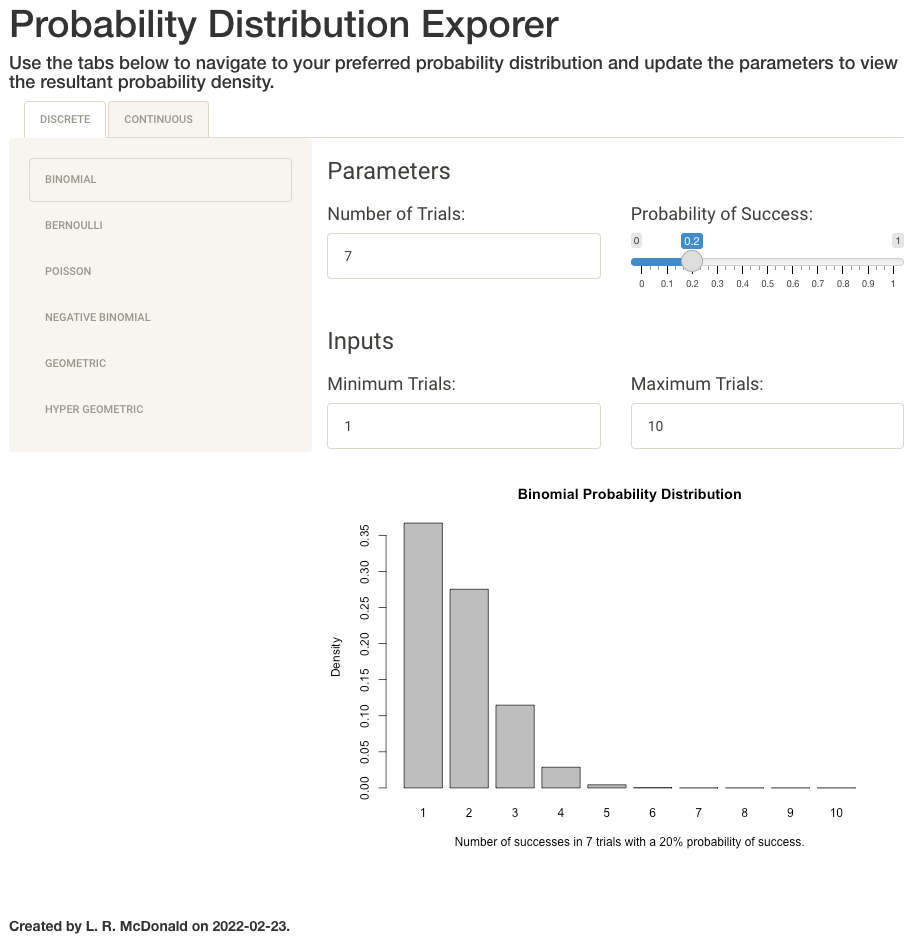

# prob_exploreR

This shiny app was developed to dynamically view probability distributions.

This package is available for installation through github:

```{r install}
devtools::install_github("lrmcdonald/exploreR")
```

If you have an old github personal access token saved, you may need to use this to unset your GITHUB_PAT.

```{r install}
Sys.unsetenv("GITHUB_PAT")
devtools::install_github("lrmcdonald/exploreR")
```

### An example window is shown below:


